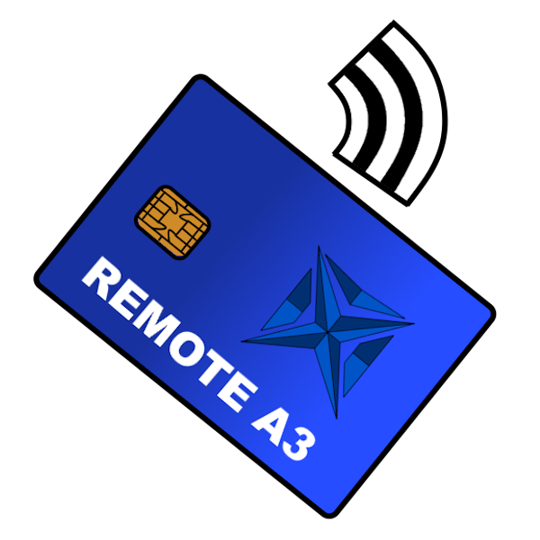

# Remote A3



Protótipo para descobrir certificados A3 conectados em computadores do dominio e desenhar o caminho para assinatura remota pela intranet.

## O que este projeto cobre agora

- Inventario de certificados no computador local ou em computadores remotos via PowerShell Remoting.
- Agente HTTP/Negotiate para listar certificados e testar uma primitiva de assinatura remota.
- Cliente de teste que pede o PIN no computador atual e chama o agente remoto.
- Documentacao da parte nativa obrigatoria para o Windows enxergar o certificado remoto como se tivesse uma chave privada local.

## Ponto importante

Importar o certificado publico no PC atual nao basta. Para qualquer programa do Windows selecionar o A3 e assinar, o certificado precisa apontar para um provedor de chave local, normalmente um KSP/CSP. Esse provedor local e quem encaminha a operacao de assinatura para o computador onde o token esta conectado.

## Uso rapido

## Instalacao automatica nos computadores com A3

Instale o setup em cada computador que pode receber um token/cartao A3.

No computador onde o A3 fica conectado, abra o menu iniciar e execute **Remote A3 Auto Register Admin**. Ele vai pedir elevacao do Windows/UAC.

Esse registro automatico:

- procura uma porta livre no intervalo `28765-28820`;
- salva a configuracao em `%LOCALAPPDATA%\RemoteA3\config\agent.settings.json`;
- registra URL ACL para o agente HTTP;
- abre firewall de entrada no perfil de dominio;
- cria a tarefa agendada `RemoteA3 Agent`;
- inicia o agente agora quando usado com `-StartNow`;
- anuncia o agente por UDP na porta `28764`.
- inicia a tarefa com PowerShell oculto, sem janela que precise ficar aberta.

Com linha de comando:

```powershell
"$env:LOCALAPPDATA\RemoteA3\bin\remote-a3-auto-register.cmd" -StartNow
```

Para procurar uma porta livre considerando varios computadores do dominio:

```powershell
"$env:LOCALAPPDATA\RemoteA3\bin\remote-a3-auto-register.cmd" `
  -ComputerName PC-CERT-01,PC-CERT-02,PC-CERT-03 `
  -StartNow
```

Para varrer todos os computadores do Active Directory:

```powershell
"$env:LOCALAPPDATA\RemoteA3\bin\remote-a3-auto-register.cmd" -FromActiveDirectory -StartNow
```

No PC atual, para receber anuncios dos computadores com agente:

```powershell
"$env:LOCALAPPDATA\RemoteA3\bin\remote-a3-receive.cmd" -Seconds 30
```

Se o agente nao responder em `/health`, inicie manualmente para ver o erro:

```powershell
& "$env:LOCALAPPDATA\RemoteA3\bin\remote-a3-auto-agent.cmd"
```

Para iniciar, parar e ver status da tarefa:

```powershell
Start-ScheduledTask -TaskName "RemoteA3 Agent"
& "$env:LOCALAPPDATA\RemoteA3\bin\remote-a3-status.cmd"
& "$env:LOCALAPPDATA\RemoteA3\bin\remote-a3-stop.cmd"
```

Observacao: a tarefa padrao inicia no logon do usuario atual, porque certificados A3 muitas vezes ficam no repositorio `CurrentUser`. Se o certificado estiver no repositorio da maquina e o provedor do token funcionar em servico, use `-Trigger AtStartup`.

```powershell
"$env:LOCALAPPDATA\RemoteA3\bin\remote-a3-auto-register.cmd" -Trigger AtStartup -StartNow
```

## Comandos manuais

Listar certificados locais com chave privada:

```powershell
.\scripts\Get-A3CertificateInventory.ps1 -OnlyWithPrivateKey
```

Por padrao, o inventario nao abre a chave privada, para evitar prompt/travamento em token A3. Se precisar diagnosticar provedor CSP/KSP, use `-ReadPrivateKeyInfo` sabendo que alguns tokens podem pedir PIN.

Listar certificados provaveis A3 em outro computador do dominio via WinRM:

```powershell
.\scripts\Invoke-DomainA3Discovery.ps1 -ComputerName PC2 -IncludePublicCertificate
```

Subir o agente no computador onde o token esta conectado:

```powershell
.\scripts\Start-A3RemoteAgent.ps1 -Prefix "http://+:28765/" -Advertise
```

Testar uma assinatura remota de hash/arquivo:

```powershell
.\scripts\Invoke-RemoteA3Sign.ps1 `
  -AgentUrl "https://PC2:8765" `
  -Thumbprint "THUMBPRINT_DO_CERTIFICADO" `
  -FilePath "C:\temp\documento.bin" `
  -PromptForPin
```

Para PIN remoto, use HTTPS. O cliente bloqueia PIN sobre HTTP por padrao.

Esse teste assina o hash de um arquivo. Ele ainda nao cria containers finais como XMLDSig, CMS/CAdES ou PDF/PAdES; esses formatos ficam na camada do aplicativo que chama a assinatura.

## Proximos passos para virar produto

## KSP nativo experimental

A partir da `0.3.0`, o projeto inclui a primeira versao do **Remote A3 Key Storage Provider** para CNG. Ele e experimental e ainda precisa ser validado com os aplicativos reais.

Nota: a partir da `0.3.6`, o registro do KSP publica corretamente a funcao CNG `KEY_STORAGE`, instala a DLL em `System32` e inclui um teste direto do provider local. Se o `certutil` mostrar `Conjunto de chaves armazenadas ausente` em um certificado Remote A3 importado com versao anterior, reinstale a versao nova, execute novamente o **Remote A3 Install KSP Admin** e importe o certificado virtual de novo.

Nota: a partir da `0.3.7`, o prompt local de PIN usa flags compativeis com `CredUIPromptForCredentials`. Isso corrige o erro `Sinalizadores invalidos` ao chamar `SignData`.

Nota: a partir da `0.3.8`, o prompt local tenta usar o modo de senha/PIN apenas, evitando a tela com usuario e senha sempre que o Windows aceitar essa combinacao de flags.

Nota: a partir da `0.3.9`, quando o certificado virtual e importado com `-Credential`, a credencial de rede do agente remoto e salva no Gerenciador de Credenciais do Windows e reutilizada pelo KSP durante a assinatura. O PIN do A3 continua sendo solicitado no PC atual.

Nota: a partir da `0.4.0`, o importador evita sintaxe C# moderna no bloco `Add-Type`, mantendo compatibilidade com o compilador padrao do Windows PowerShell.

Fluxo no PC atual:

1. Instalar o setup que inclui os binarios nativos `RemoteA3Ksp.dll` e `RemoteA3KspAdmin.exe`.
2. Registrar o KSP como administrador:

```powershell
& "$env:LOCALAPPDATA\RemoteA3\bin\remote-a3-install-ksp.cmd"
```

3. Validar se o Windows consegue abrir o KSP local:

```powershell
& "$env:LOCALAPPDATA\RemoteA3\bin\remote-a3-test-ksp.cmd"
```

4. Importar um certificado remoto virtual apontando para o agente:

```powershell
& "$env:LOCALAPPDATA\RemoteA3\bin\remote-a3-install-virtual-cert.cmd" `
  -AgentUrl "http://CARTORIO-02:28765/" `
  -Thumbprint "THUMBPRINT_DO_CERTIFICADO"
```

Se o agente remoto retornar `401 Nao Autorizado`, passe credencial explicita:

```powershell
$cred = Get-Credential
& "$env:LOCALAPPDATA\RemoteA3\bin\remote-a3-install-virtual-cert.cmd" `
  -AgentUrl "http://CARTORIO-02:28765/" `
  -Thumbprint "THUMBPRINT_DO_CERTIFICADO" `
  -Credential $cred
```

5. Testar se o Windows chama o provedor:

```powershell
& "$env:LOCALAPPDATA\RemoteA3\bin\remote-a3-test-virtual-cert.cmd" `
  -Thumbprint "THUMBPRINT_DO_CERTIFICADO"
```

Limitacoes atuais:

- KSP CNG apenas; CSP legado ainda nao foi implementado.
- Assinatura RSA PKCS#1/PSS.
- O PIN e pedido no PC atual pelo KSP e enviado ao agente; use HTTPS antes de producao.
- Alguns aplicativos podem exigir `ExportKey`/comparacao de chave publica, que ainda esta limitado nesta alpha.

## Proximos passos para virar produto

1. Validar o KSP com e-CAC, assinadores PDF e emissores usados no ambiente.
2. Implementar `ExportKey` para comparacao completa da chave publica.
3. Adicionar HTTPS interno automatico por CA do dominio.
4. Adicionar CSP legado se algum sistema antigo nao usar CNG.

